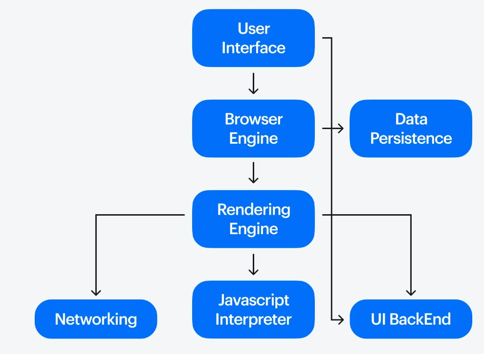

# Hyper Text Markup Language
## What Is a Markup Language?
A markup language is a system for defining the structure, presentation, and/or purpose of content within a digital document so computer programs can interpret and display the content correctly.

* Markup languages encode text using specific vocabulary, symbols, and/or syntax rules.

* For example, the h1 tag in HTML (hypertext markup language) communicates that the enclosed text is a top-level heading.

* Search engines can use this information to better understand the subject matter of your page. While browsers can use this information to apply the relevant styling.
---
## type of Markup Language
**Semantic markup** (or descriptive markup) provides meaning to content by labeling that content’s structure and purpose. Which can help browsers, search engines, and developers interpret the content correctly.

* For example, in XML, <author>John Doe</author> identifies "John Doe" as the author of an article. But the markup doesn’t affect the presentation of this text.

**Presentational markup** controls the visual appearance of content so users see content in a specific way. This markup defines how the text should look without specifying how the system should render it.

* For example, in HTML, <b>Bold Text</b> marks the enclosed text as bold but doesn’t dictate the exact process the browser should use to achieve that appearance.

**Procedural markup** provides step-by-step commands for how content should be processed, formatted, or displayed. Instead of defining appearance, this markup directs the system on what to do with the text.

* For example, In LaTeX, \textbf{Bold Text} instructs the typesetting system to apply a bold font weight based on its backend processing rules.
---
# How does Web Works
## What is HTTP?
First things first, what is HTTP? HTTP is a TCP/IP-based application layer communication protocol that standardizes how clients and servers communicate with each other. It defines how content is requested and transmitted across the internet. By application layer protocol, I mean that it’s simply an abstraction layer that standardizes how hosts (clients and servers) communicate. HTTP itself depends on TCP/IP to get requests and responses between the client and server. By default, TCP port 80 is used, but other ports can also be used. HTTPS, however, uses port 443. 
Based on the uploaded images, here is the transcribed text, organized by the topics and versions of HTTP discussed:

### 1. HTTP/0.9 (1991)
* **Simple protocol**
* `GET` method only used
* $\rightarrow$ Request, Response

### 2. HTTP/1.0 (1996)
* Sending files plain text, HTML, Image file,
* `POST`, `HEAD`, `GET`
* request, response, status.
* But it does not support the
* Three ways handshaking.

### 3. HTTP/1.1 (1997)
* Added method (`PUT`, `OPTION`, `DELETE`)
* Pipelining used
* But **disadvantages**:
    * Chunks $\rightarrow$ 10 HTML, 5 stylesheet, 5 javascript. It
    * will be send separately, so it
    * will have **low latency**.
    * $\rightarrow$ We cannot able to achieve HTTP status. (Note: This point seems contradictory in the notes; usually, separate requests increase latency/overhead, and HTTP status codes are standard).

### 4. SPDY (2009)
* $\rightarrow$ Google
* $\rightarrow$ Introduced network
    * band width, latency
    * network Compression, network response
* But it does not rely on HTTP method, $\rightarrow$ It get grate compute they dropped SPDY but they inspired the idea to develop more HTTP/2

### 5. HTTP/2 (2015)
* $\rightarrow$ **low latency**
* $\rightarrow$ **Binary protocol**
* $\rightarrow$ **Multiplexing**
* $\rightarrow$ **Network security**
* $\rightarrow$ **Request prioritization**

[whether you need to understand the depth concept](https://cs.fyi/guide/http-in-depth)
---
# Domain Names
## What is meant by Domain Name?
Domain names are a key part of the Internet infrastructure. They provide a human-readable address for any web server available on the Internet.

* Any Internet-connected computer can be reached through a public IP Address, either an IPv4 address (e.g., 192.0.2.172) or an IPv6 address (e.g., 2001:db8:8b73:0000:0000:8a2e:0370:1337).

* Computers can handle such addresses easily, but people have a hard time finding out who is running the server or what service the website offers. IP addresses are hard to remember and might change over time.

* To solve all those problems we use human-readable addresses called domain names.

### Structure of domain names
A domain name has a simple structure made of several parts (it might be one part only, two, three…), separated by dots and read from right to left:

Anatomy of the MDN domain name

Each of those parts provides specific information about the whole domain name.

### TLD (Top-Level Domain).
* TLDs tell users the general purpose of the service behind the domain name. The most generic TLDs (.com, .org, .net) don't require web services to meet any particular criteria, but some TLDs enforce stricter policies so it is clearer what their purpose is. For example:

* Local TLDs such as .us, .fr, or .se can require the service to be provided in a given language or hosted in a certain country — they are supposed to indicate a resource in a particular language or country.
* TLDs containing .gov are only allowed to be used by government departments.
* The .edu TLD is only for use by educational and academic institutions.
* TLDs can contain special as well as latin characters. A TLD's maximum length is 63 characters, although most are around 2–3.

### Label (or component)
The labels are what follow the TLD. A label is a case-insensitive character sequence anywhere from one to sixty-three characters in length, containing only the letters A through Z, digits 0 through 9, and the '-' character (which may not be the first or last character in the label). a, 97, and hello-strange-person-16-how-are-you are all examples of valid labels.The label located right before the TLD is also called a Secondary Level Domain (SLD).

### Finding an available domain name
* To find out whether a given domain name is available,
Go to a domain name registrar's website. Most of them provide a "whois" service that tells you whether a domain name is available.

* Alternatively, if you use a system with a built-in shell, type a whois command into it, as shown here for mozilla.org:
---
## Hosting
Web hosting stores website files on servers, making sites accessible online. Types include shared (multiple sites per server) and dedicated (exclusive server) hosting. Providers offer additional services like email, domains, and security certificates. Critical for website performance and accessibility.
---
## What is DNS?
The Domain Name System (DNS) is the phonebook of the Internet. Humans access information online through domain names, like nytimes.com or espn.com. Web browsers interact through Internet Protocol (IP) addresses. DNS translates domain names to IP addresses so browsers can load Internet resources.

Each device connected to the Internet has a unique IP address which other machines use to find the device. DNS servers eliminate the need for humans to memorize IP addresses such as 192.168.1.1 (in IPv4), or more complex newer alphanumeric IP addresses such as 2400:cb00:2048:1::c629:d7a2 (in IPv6).
## How does DNS work?
The process of DNS resolution involves converting a hostname (such as www.example.com) into a computer-friendly IP address (such as 192.168.1.1). An IP address is given to each device on the Internet, and that address is necessary to find the appropriate Internet device - like a street address is used to find a particular home. When a user wants to load a webpage, a translation must occur between what a user types into their web browser (example.com) and the machine-friendly address necessary to locate the example.com webpage.

In order to understand the process behind the DNS resolution, it’s important to learn about the different hardware components a DNS query must pass between. For the web browser, the DNS lookup occurs "behind the scenes" and requires no interaction from the user’s computer apart from the initial request.
[more to know](https://www.cloudflare.com/en-gb/learning/dns/what-is-dns/)
---
## Browsers
Web browsers request and display websites by interpreting HTML, CSS, and JavaScript. Use rendering engines (Blink, Gecko) for display and JavaScript engines (V8) for code execution. Handle security, bookmarks, history, and user interactions for web navigation.
### How a Web Browser Works?
Now that we know how web browsers have evolved, let’s look at how they work. Here’s a breakdown of how a web browser converts behind-the-scenes technical jargon into a user-friendly experience.

### Rendering Engine - The Web Architecture
It is the main component of a web browser that converts the website code into visual elements visible on a web page. The rendering engine receives instructions from a browser, interprets them, and builds a webpage accordingly. Following are the rendering engines used by mainstream browsers:

**Blink**: This engine powers Google Chrome and is known for its speed and efficiency.
**WebKit**: Used in Safari (Apple devices) and other browsers, WebKit offers robust features for rendering complex webpages.
**Gecko**: The engine behind Mozilla Firefox prioritizes open-source development and standards compliance.
### Browser Components
While the rendering engine plays a central role in the working of a web browser, multiple other components bring to you any web page you access via the internet. Some key components include:

**User Interface (UI)**: You interact with it directly. It includes the address bar, where you enter website addresses, the back and forward buttons for navigation, and the tabs that allow you to open multiple websites simultaneously.
**Rendering Engine**: As discussed, the architect is responsible for building the visual representation of the webpage.
**Networking Component**: It fetches website files (code, images, videos) from web servers worldwide, ensuring all the necessary pieces are delivered to the rendering engine to build the web page.
**JavaScript Engine**: It interprets and executes JavaScript code, allowing webpages to respond to user actions and create dynamic experiences.
**Security Components**: They handle tasks like encrypting data transmissions (HTTPS) and protecting you from malicious websites.
---
### Search Engine Optimization (SEO)
Search Engine Optimization, or SEO, is the practice of improving your website to increase its visibility when people search for products or services related to your business in search engines like Google. The better visibility your pages have in search results, the more likely you are to garner attention and attract prospective and existing customers to your business. A related concept, Generative Engine Optimization (GEO), focuses on optimizing content for AI-powered search experiences, ensuring your information is accurately and effectively presented in AI-generated summaries and responses.
---